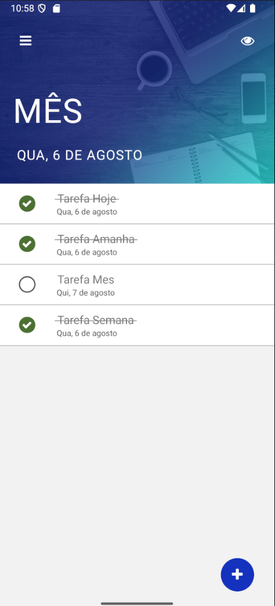

# 📋 App de Tarefas - React Native + PostgreSQL

Aplicativo mobile de gerenciamento de tarefas, desenvolvido em **React Native** com backend em **Node.js** e banco de dados **PostgreSQL**. O app oferece uma experiência prática e eficiente para acompanhar tarefas diárias, com **autenticação JWT** e persistência de usuário local.

---

## 🚀 Funcionalidades

- ✅ **Autenticação de Usuário** com **JWT**
- 🔒 **Persistência de Login** (usuário salvo localmente)
- ➕ **Adicionar tarefas**
- ❌ **Remover tarefas**
- ✔️ **Marcar tarefas como feitas ou não feitas**
- 📅 **Filtros de visualização** por data:
  - Tarefas de **hoje**
  - Tarefas de **amanhã**
  - Tarefas para **dentro de uma semana**
  - Tarefas para **dentro de um mês**
- 🚪 **Logout seguro** via botão no menu

---

## 🧰 Tecnologias Utilizadas

### Frontend (Mobile)
- [React Native](https://reactnative.dev/)
- [React Navigation](https://reactnavigation.org/)
- [Axios](https://axios-http.com/)
- AsyncStorage para persistência local

### Backend
- [Node.js](https://nodejs.org/)
- [Express](https://expressjs.com/)
- [PostgreSQL](https://www.postgresql.org/)
- [Knex.js](http://knexjs.org/) para query builder
- [JWT](https://jwt.io/) para autenticação segura

---

## 🖥️ Telas do App

- 
- 
- 
- 

---

👨‍💻 Autor
Enzo Ricardo
